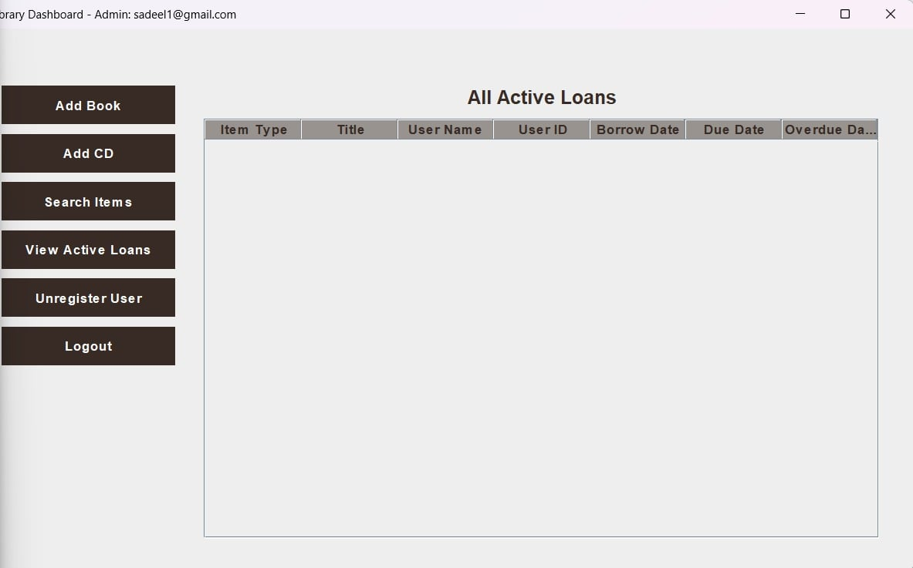
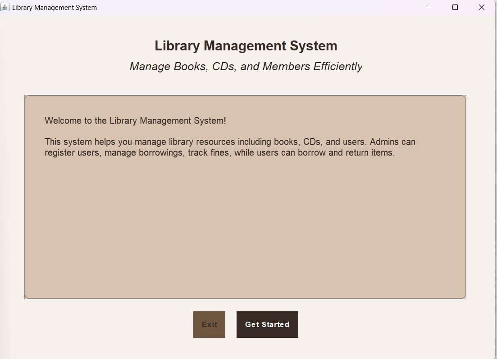
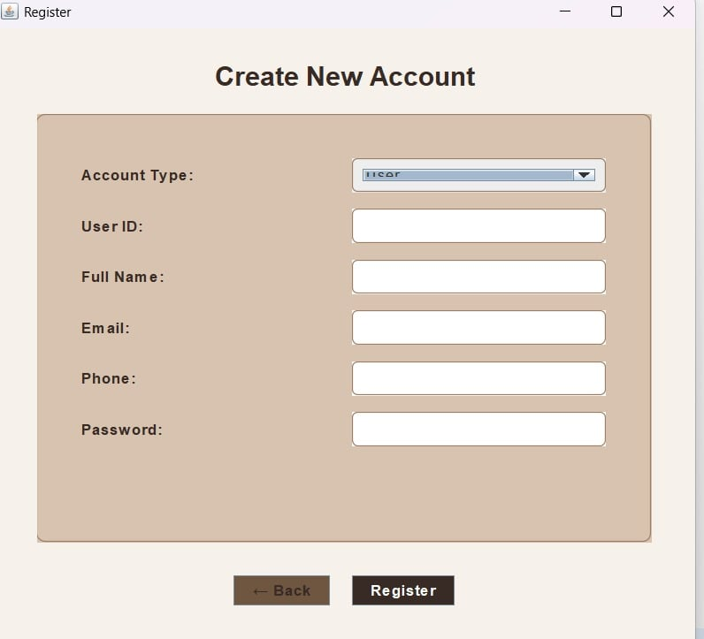
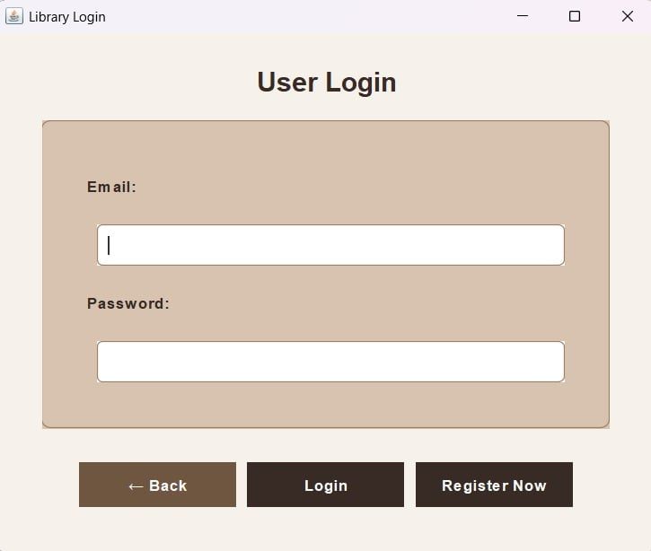
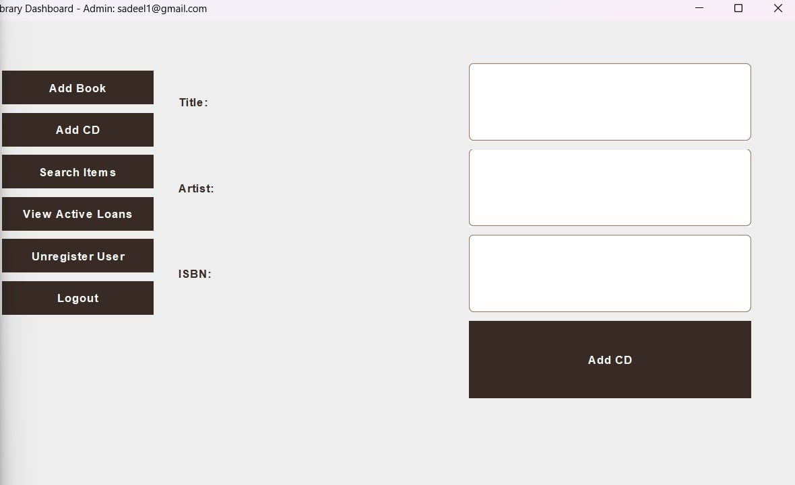

# Library Management System

Java/Maven project developed for the **Software Engineering course (Fall 2025)** at university.

This repository implements a layered Library Management System with GUI screens, business services, domain models, unit tests, and CI analysis tooling (JaCoCo + SonarCloud) based on the provided course material.

## Course Context

This project aligns with the requirements in:
- `Fall_2025_SE_Project_Library_System.pdf`
- `Jacoco tutorial.pdf`
- `SonarCloud_GitHubActions_Tutorial_2025.docx.pdf`

## Implemented Features

- Admin authentication flow (login/logout)
- Book and CD management
- Search support for library items
- Borrowing rules:
  - Book loan period: 28 days
  - CD loan period: 7 days
- Overdue detection and fine calculation
- Borrow restriction when user has overdue items or unpaid fines
- User unregistration constraints (active loans/unpaid fines are blocked)
- Reminder notification support via observer-based notifier design

## Design & Architecture

- **Architecture style:** layered structure (`app`, `service`, `model`)
- **Strategy Pattern:** fine calculation per media type
  - `BookFineStrategy` (book fines)
  - `CDFineStrategy` (CD fines)
- **Observer Pattern:** notifications/reminders
  - `Observer`
  - `EmailNotifier`

## Project Structure

- `src/main/java/com/library/app` - UI and application entry points
- `src/main/java/com/library/service` - business logic and design patterns
- `src/main/java/com/library/model` - domain entities
- `src/test/java/tests` - JUnit 5 unit tests
- `.github/workflows/build.yml` - GitHub Actions CI for build/test/analysis

## Tech Stack

- Java 8+
- Maven
- JUnit 5
- Mockito
- JaCoCo (coverage reports)
- SonarCloud (static analysis in CI)

## Build and Run

### 1) Run tests

```bash
mvn clean test
```

### 2) Generate coverage report

```bash
mvn clean test jacoco:report
```

JaCoCo XML report path:
- `target/site/jacoco/jacoco.xml`

### 3) Run the application

Run main class:
- `com.library.app.Main`

## CI / SonarCloud Notes

- GitHub Actions workflow is defined in `.github/workflows/build.yml`.
- SonarCloud scan runs only when `SONAR_TOKEN` is configured in repository secrets.
- If `SONAR_TOKEN` is missing, the workflow skips SonarCloud gracefully and still completes build/test.

## Educational Objective

This project is an academic implementation for the **Software Engineering university course**, focused on:
- incremental sprint-based delivery,
- applying design patterns,
- unit testing and mocking,
- measuring test coverage,
- and static code quality analysis.

## Some Project Images






